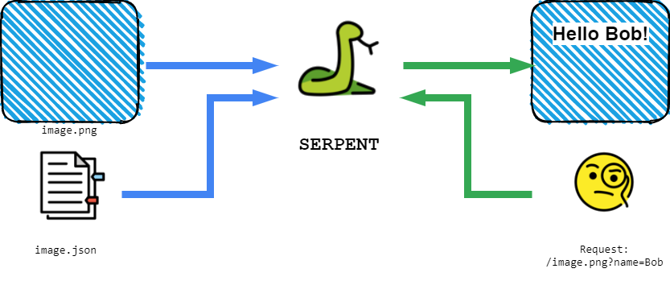

# 🐍 Serpent (Serverless Picture Enrichment Toolkit)

[](https://app.codacy.com/manual/fritzjo-git/serpent?utm_source=github.com&utm_medium=referral&utm_content=FritzJo/serpent&utm_campaign=Badge_Grade_Dashboard)


## Description
This repository contains the code for a simple web service to create dynamically customized images. Textfields and other extras are defined in configuration files and their content can be assigned for each request by using URL parameters!
It's made to be easily deployed to Google Cloud Run to provide custom embeddable images at minimal cost.

## Functionality
* Add text to an image
  * Flexible content of each textfield, defined by URL parameters
  * Position, font, color and parameter name are configurable via json files
* Add overlay-images
* Add simple progress bars

## Configuration
Serpent uses a json file to describe all changes that will be made to a given image. These files are called *layouts*. An example can be found in [```static/layouts/example.json```](static/layouts/example.json).

To get further information about all options and the structure of layouts: Check out the [documentation](doc/Configuration.md)

## Deployment
Serpent supports two major options for deployment: local and on [GCP](https://cloud.google.com). The local deployment should only be used for development and testing purposes. You could still run it in production with limitations regarding flexibility and performance.
### Local
#### Python
``` bash
git clone https://github.com/FritzJo/serpent.git
cd serpent
pip install -r requirements.txt
python app.py
```
Its generally recommended to use a virtual environment, instead of installing all packages globally. You can find more information on how to do that [here](https://docs.python.org/3/tutorial/venv.html)
#### Docker
``` bash
git clone https://github.com/FritzJo/serpent.git
cd serpent
docker build -t serpent .
docker run  -p 5000:5000 serpent
```

After successfully deploying the application you can test if everything is working by opening the following link in your browser:
[```http://localhost:5000/example.png?text=HelloWorld```](http://localhost:5000/example.png?text=HelloWorld)

You should see [this image](doc/result.png)

### Google Cloud Plattform
TODO

## FAQ
### 1. What are the restrictions in a local deployment
* Images can't be loaded from remote locations and have to be placed in the [```static/images```](static/images) folder.
* Same goes for layouts ( [```static/layouts```](static/images))
* If you use Docker, you have to build a new docker image for every change in configuration (and for each added image)
* The flask backend runs in development mode and therefor only supports very few simultaneous connections.
* This tool is developed with GCP in mind and only tested for that environment.
